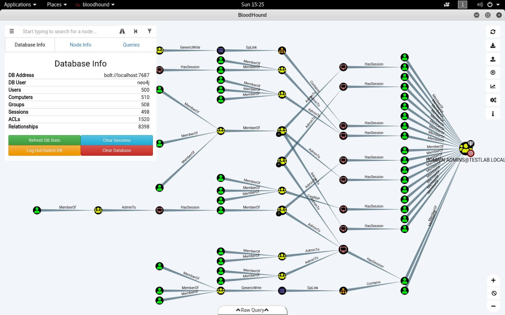

# Reconnaissance Windows
Etape de découverte du réseau et des services ouverts.
Contexte : machine interne **déjà connectée** au réseau de l'entreprise.

## Ping Castle
[Site Web](https://www.pingcastle.com/)

### Description
Mapper un domaine, un AD, ou encore auditer les droits potentiels d'une ou plusieurs machines.
Possibilité de le lancer soit en mode intéractif soit en mode ligne de commande.
Rapport sur les utilisateurs, groupes, comptes de service, GPO etc...

### Options
1. healthcheck
    * pour un scan complet : ```--no-enum-limit```
2. permissions-analyze
3. scanner
    * sur une machine hôte

### Screenshots


## NLTest
[Documentation Microsoft](https://docs.microsoft.com/en-us/previous-versions/windows/it-pro/windows-server-2012-R2-and-2012/cc731935(v=ws.11))

### Description
Récupérer les controlleurs de domaine dont :
   * les DNS
   * les AD DS

### Exemples
Exemples Microsoft
```
$ nltest /dclist:domain.local
Get list of DCs in domain 'ntdev' from '\\fourthcoffee-dc-01'.
    fourthcoffee-dc-01.forthcoffee.com       [DS] Site: Rome
    fourthcoffee-dc-04.forthcoffee.com       [DS] Site: LA
    fourthcoffee-dc-09.forthcoffee.com       [DS] Site: NYC
    fourthcoffee-dc-12.forthcoffee.com       [DS] Site: Paris
    fourthcoffee-dc-99.forthcoffee.com       [DS] Site: Redmond
    fourthcoffee-dc-63.forthcoffee.com [PDC] [DS] Site: London
The command completed successfully

$ nltest /user:"TestAdmin"
User: User1
Rid: 0x3eb
Version: 0x10002
LastLogon: 2ee61c9a 01c0e947 = 5/30/2001 13:29:10
PasswordLastSet: 9dad5428 01c0e577 = 5/25/2001 17:05:47
AccountExpires: ffffffff 7fffffff = 9/13/30828 19:48:05
PrimaryGroupId: 0x201
UserAccountControl: 0x210
CountryCode: 0x0
CodePage: 0x0
BadPasswordCount: 0x0
LogonCount: 0x33
AdminCount: 0x1
SecurityDescriptor: 80140001 0000009c 000000ac 00000014 00000044 00300002 000000
02 0014c002 01050045 00000101 01000000 00000000 0014c002 000f07ff 00000101 05000
000 00000007 00580012 00000003 00240000 00020044 00000501 05000000 00000015 22cd
b7b4 7112b3f1 2b3be507 000003eb 00180000 000f07ff 00000201 05000000 00000020 000
00220 00140000 0002035b 00000101 01000000 00000000 00000201 05000000 00000020 00
000220 00000201 05000000 00000020 00000220
AccountName: User1
Groups: 00000201 00000007
LmOwfPassword: fb890c9c 5c7e7e09 ee58593b d959c681
NtOwfPassword: d82759cc 81a342ac df600c37 4e58a478
NtPasswordHistory: 00011001
LmPasswordHistory: 00010011
The command completed successfully
```

# Reconnaissance Kali
Contexte : machine externe **déjà connectée** au réseau de l'entreprise.

## Nmap
[CheatSheet 1](https://percussiveelbow.github.io/nmap-cheatsheet/)
[CheatSheet 2](https://gist.github.com/ddubson/45d9ed28ba2cbd18ecfff893c9c50534)

### Exemples
Scan niveau TCP standard + service avec enregistrement dans un fichier log :
```
$ sudo nmap -sT -sV -p 200 IP -oA output.log
```

## BloodBound
[GitHub](https://github.com/BloodHoundAD/Bloodhound/wiki)

### Description
Génération des différents chemins possibles entre machines et serveurs d'un domaine.

### Screenshots
Par *c0d3xpl0it*


